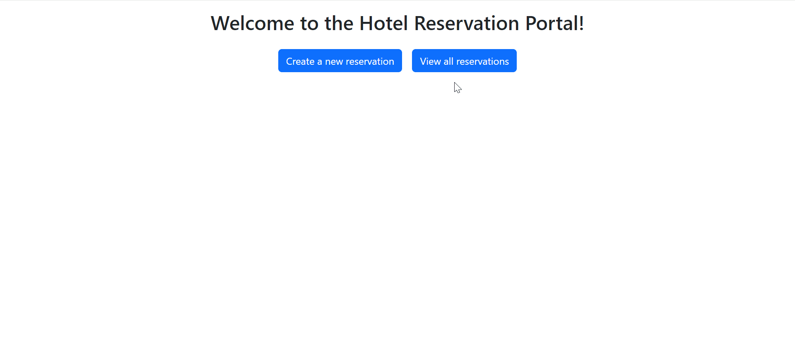

# Hotel App 🏨

`hotel-reservation-app-shai.vercel.app`

**Hotel App** is a web application built using Angular (18.2) and TypeScript to manage hotel rooms. This project implements CRUD operations—Create, Read, Update, and Delete—enabling users to effectively handle hotel data. The app features a responsive design made with Bootstrap and provides a user-friendly interface to view room data in a list format.

## Preview



## Overview

The **Hotel App** allows users to manage hotel reservations easily. It supports creating new reservations, viewing all existing reservations, updating reservation details, and deleting reservations from the system. All data is stored locally in the user's browser using Local Storage, providing persistence between sessions.

## Features

- **CRUD Operations:** Users can Create, Read, Update, and Delete hotel reservations.
- **Validation:** Input forms are validated using Angular's built-in validators to ensure correct data entry.
- **Routing:** The application uses Angular routing for smooth navigation between pages.
- **Service Layer:** CRUD operations are handled by a dedicated service that abstracts away interaction with Local Storage.
- **Bootstrap Design:** The app is styled using Bootstrap, ensuring a clean and responsive design across all devices.

## User Actions

1. Create a new reservation.
2. Update an existing reservation.
3. Delete a reservation.
4. Display all reservations.

## Technologies Used

- **Angular**
- **TypeScript**
- **Bootstrap**

## Getting Started

To run the project locally, follow these steps:

1. Clone the repository:

   ```bash
   git clone https://github.com/benhemoshai/hotel-app.git
   ```

2. Navigate to the project directory:

   ```bash
   cd hotel-app
   ```

3. Install the required dependencies:

   ```bash
   npm install
   ```

4. Run the application:

   ```bash
   ng serve -o
   ```

   Open your browser and go to `http://localhost:4200/` to see the application in action.

## Project Structure

```bash
src/
│
├── app/
│   ├── home/                   # Home component
│   ├── models/                 # Data models for reservations
│   ├── reservation-form/       # Form component for creating/updating reservations
│   ├── reservation-list/       # Component for displaying reservation list
│   ├── reservation/            # Reservation service for CRUD operations
│   ├── app-routing.module.ts   # Routing module for navigation
│   ├── app.component.css       # Global styles for app component
│   ├── app.component.html      # App component template
│   ├── app.component.spec.ts   # App component unit test
│   ├── app.component.ts        # Main app component logic
│   ├── app.module.ts           # App module declaration
│
├── assets/                     # Static assets like images and icons
├── favicon.ico                 # Favicon for the application
├── index.html                  # Main HTML file
├── main.ts                     # Angular entry point
├── styles.css                  # Global styles
├── .editorconfig               # Editor configuration
├── .gitignore                  # Files to ignore for git
├── README.md                   # Project documentation
├── angular.json                # Angular project configuration
├── package-lock.json           # Locked dependencies
├── package.json                # Project dependencies
├── tsconfig.app.json           # TypeScript configuration for app
├── tsconfig.json               # TypeScript global configuration
├── tsconfig.spec.json          # TypeScript configuration for tests

```

## Focus on Validators and Routing

- **Validators:** Angular's form validation mechanisms are employed to ensure that users provide valid room details (e.g., non-empty fields, correct formats).
- **Routing:** Angular's router is utilized to navigate between different views such as the room list and form pages.
- **Local Storage Integration:** All CRUD operations are saved locally using the browser's Local Storage, ensuring persistent data between sessions.
